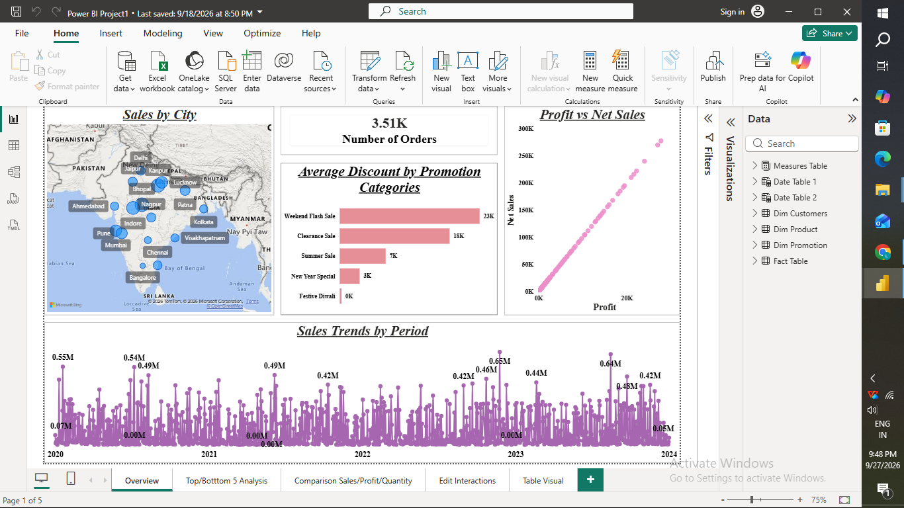
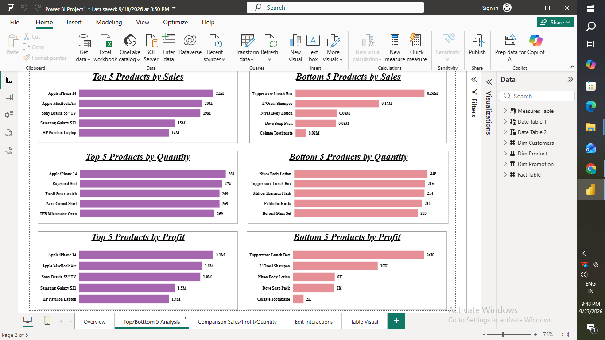
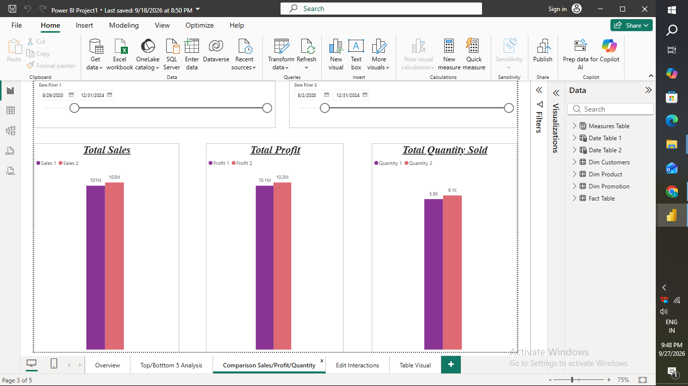
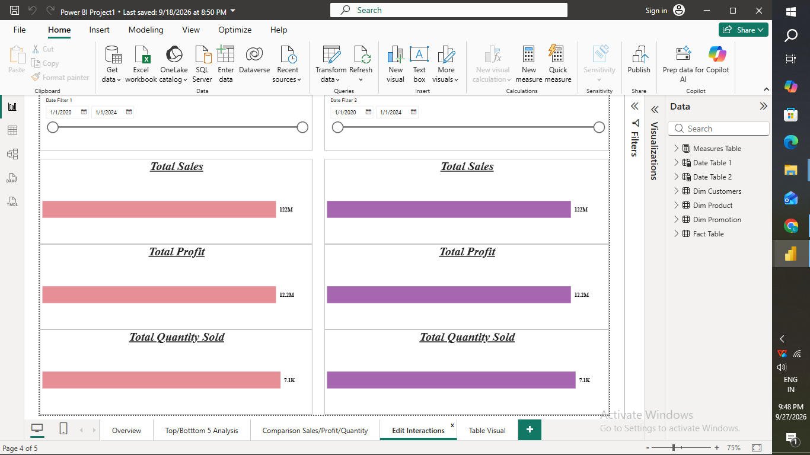
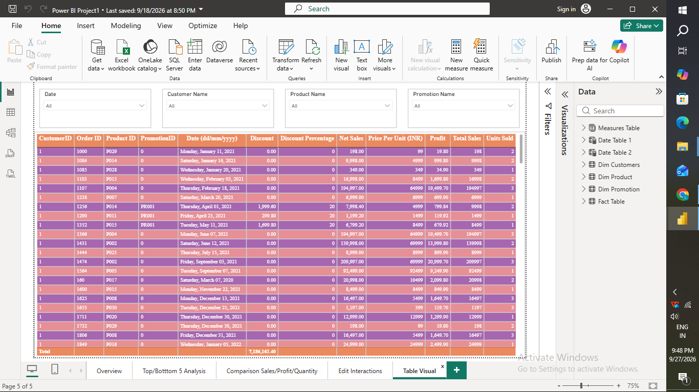

# Sales & Profit Analysis Dashboard (Power BI)

A 5-page Power BI dashboard analyzing retail sales, profit, and quantity trends (2020–2024) using a star-schema data model (Fact Table + Dim Customers, Dim Product, Dim Promotion, two Date Tables, Measures Table).

## Pages

**Overview** — Sales-by-city map, order count card, avg. discount by promotion, profit vs. net sales scatter, sales trend line

**Top/Bottom 5 Analysis** — Best & worst products by sales, quantity, and profit

**Comparison Sales/Profit/Quantity** — Two independent date sliders comparing any two custom periods

**Edit Interactions** — Demonstrates controlling how visuals filter/highlight each other

**Table Visual** — Detailed order-level table with slicers

## Skills Practiced
- Star-schema data modeling & DAX measures (Total Sales, Profit, Quantity Sold)
- Dual date tables for period-over-period comparison
- Top N / Bottom N ranking visuals
- Edit interactions between visuals
- Map, scatter, line, bar, card, and table visuals; slicers & cross-filtering

## File
`Power_BI_Project1.pbix` — open in Power BI Desktop
